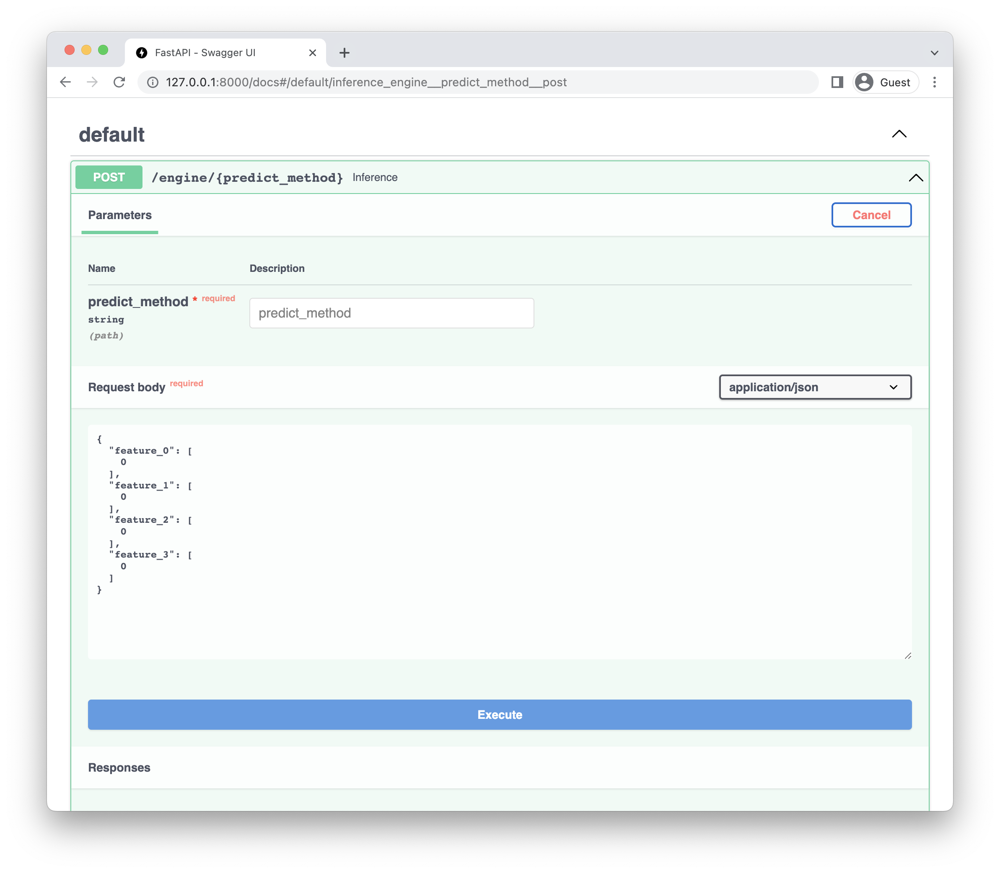
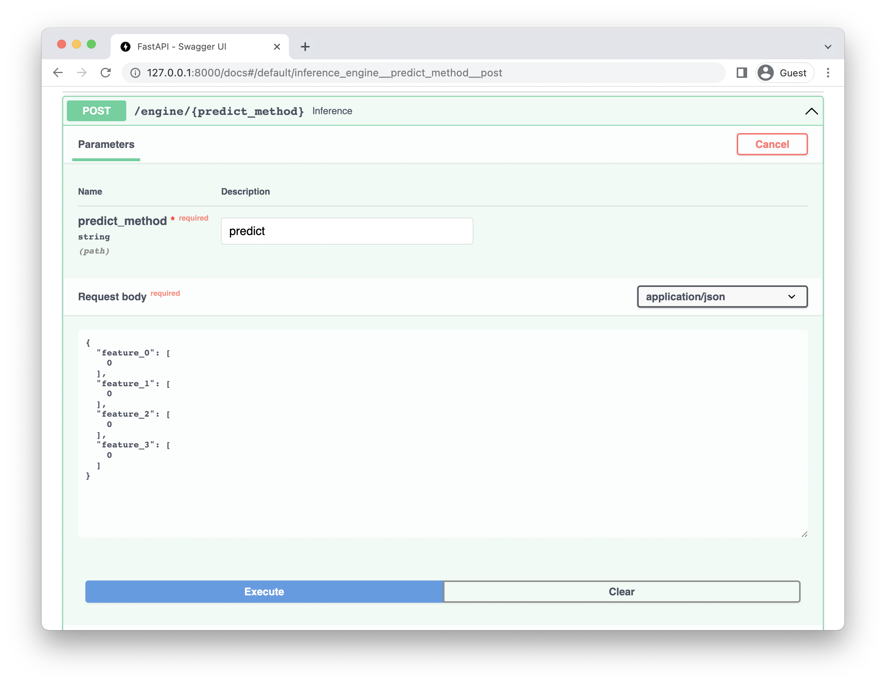
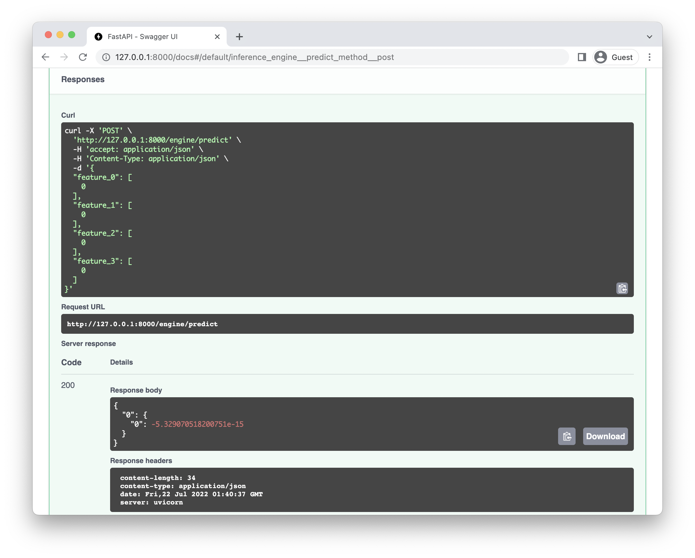
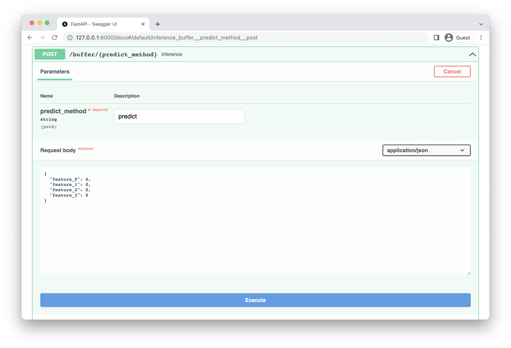
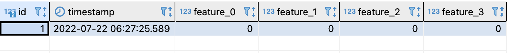

# ml-service

## Requirements
1. Poetry
osx / linux / bashonwindows install instructions:

```bash
curl -sSL https://raw.githubusercontent.com/python-poetry/poetry/master/get-poetry.py | python -
```

Check more details in [Poetry Docs](https://python-poetry.org/docs/).

2. RClone

To install rclone on Linux/macOS/BSD systems, run:

    ```bash
    curl https://rclone.org/install.sh | sudo bash
    ```

Check more details in [RClone Download](https://rclone.org/downloads/).

## Tutorial

### Install

1. Install project with poetry

```bash
poetry install
```

### Train model

1. Run MlFlow Server

```bash
make run-mlflow
```

2. Train a model with given script.

```bash
poetry run python tutorial/train.py
```

### Download model from model registry

1. Go to mlflow ui page and check its run id

[http://localhost:5000](http://localhost:5000)

1. Download model to local with `ml-service sync`.

```bash
poetry run ml-service sync --run-id=...
```

3. Check download is complete.

```bash
ls mnt/artifacts/model/
```

If completed you'll get result as below

```bash
MLmodel          conda.yaml       model.pkl        python_env.yaml  requirements.txt
```

### Run FastAPI Server

1.  Run fastapi server with `ml-service server`.

```bash
poetry run ml-service server --model-name "model" --artifact-path "mnt/artifacts"
```

2. Check fastapi docs site:

[http://127.0.0.1:8000/docs](http://127.0.0.1:8000/docs)

### After deployment

1. Go to FastAPI docs site:


2. Check engine post



3. Write `predict_method` to use, in this tutorial we use `predict`. And click excute.



4. After excute, you can get result as below:




## Tutorial with buffer

Buffer domain save input data to postgres server.

### Requirements

1. postgresql

Install postgresql with instruction [[LINK](https://www.postgresql.org/download/)].


### Setup

1. init db folder to start:

```bash
make initdb
```

2. run postgresql server:

```bash
make run-postgres
```

3. add user to postgresql server:

```bash
make init-user
```

### Run FastAPI Server

1.  Run fastapi server with `ml-service server` with `--use-buffer` argument.

```bash
poetry run ml-service server --model-name "model" --artifact-path "mnt/artifacts" --use-buffer
```

### After deployment

1. Use buffer domain and execute.



### Check DB

1. Connect to DB with below information:
    - db: postgres
    - user: postgres
    - password: password

2. Check `input` table:


