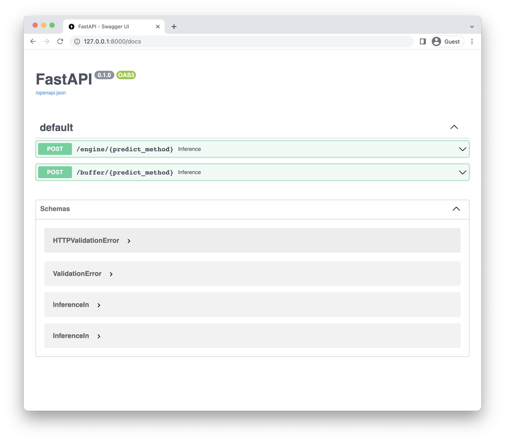

# ml-service

## Requirements
### Poetry

#### osx / linux / bashonwindows install instructions

```bash
curl -sSL https://raw.githubusercontent.com/python-poetry/poetry/master/get-poetry.py | python -
```

Check more details in [Poetry Docs](https://python-poetry.org/docs/).

### RClone

#### To install rclone on Linux/macOS/BSD systems, run:

```bash
curl https://rclone.org/install.sh | sudo bash
```

Check more details in [RClone Download](https://rclone.org/downloads/).

## How to use in local
### 1. Install project with poetry

```bash
poetry install
```

### 2. Run MlFlow Server

```bash
make run-mlflow
```

### 3. Train a model with given script.

```bash
poetry run python tutorial/train.py
```

### 4. Go to mlflow ui page and check its run id

[http://localhost:5000](http://localhost:5000)

### 5. Download model to local

```bash
poetry run ml-service sync --run-id=...
```

Check download is complete.

```bash
ls mnt/artifacts/model/
```

If completed you'll get result as below

```bash
MLmodel          conda.yaml       model.pkl        python_env.yaml  requirements.txt
```

### 6. Run fastapi server

```bash
poetry run ml-service server --model-name "model" --artifact-path "mnt/artifacts"
```

### 7. Check fastapi docs site

[http://localhost:8000/docs](http://localhost:8000/docs)


## After deployment

### 1. Fastapi docs site

Fastapi docs site looks like below:



### 2. Check engine post


### 3. Write predict_method to use

In this tutorial we use `predict`.


### 4. Execute

After excute, you can get result as below:


